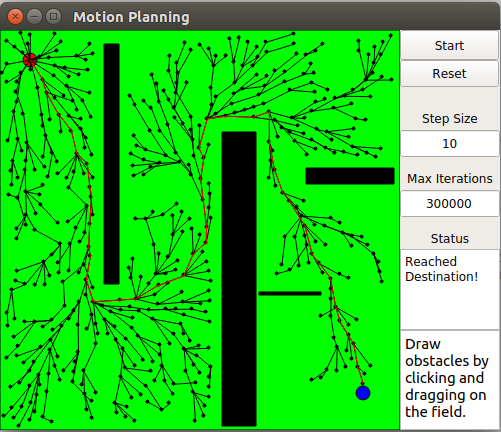
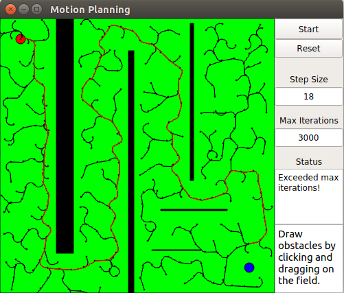

# RRT Simulator

## Dependencies
* Qt5
* Eigen

## Compiling
```bash
$ git clone https://github.com/mpdmanash/rrt-star-dubins-sim
$ cd rrt-star-dubins-sim/
$ chmod +x build.sh
$ ./build.sh
```
Run the exectuable as
```
$ ./bin/motion-planning-demo
```
## Interface

   
Example of an RRT* motion plan    

    
Example of an RRT motion plan for Dubins Nonholonomic Robot.    

Thanks to:    
RRT simulator: https://github.com/sourishg/rrt-simulator   
Dubins Curves: https://github.com/AndrewWalker/Dubins-Curves    

*Note: Draw obstacles by clicking and dragging on the field.*
